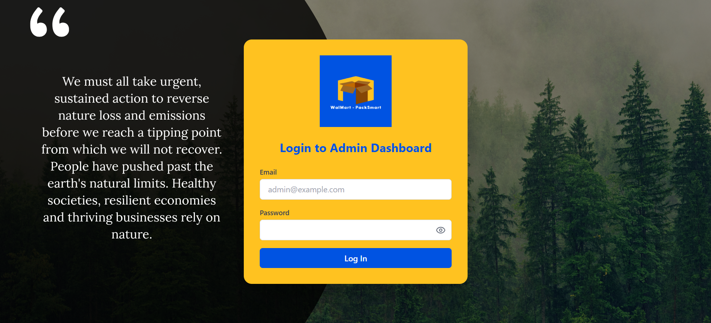
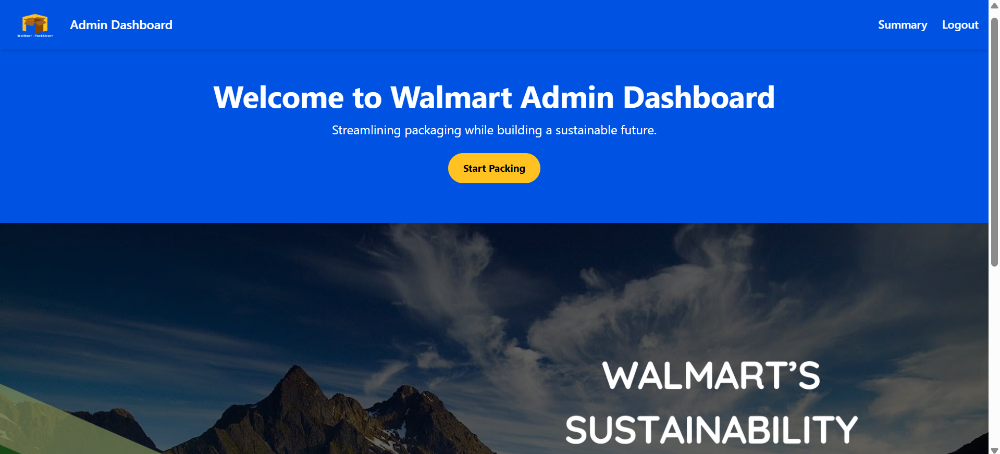
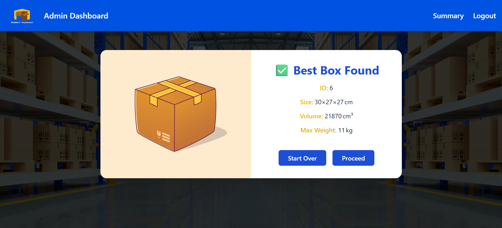
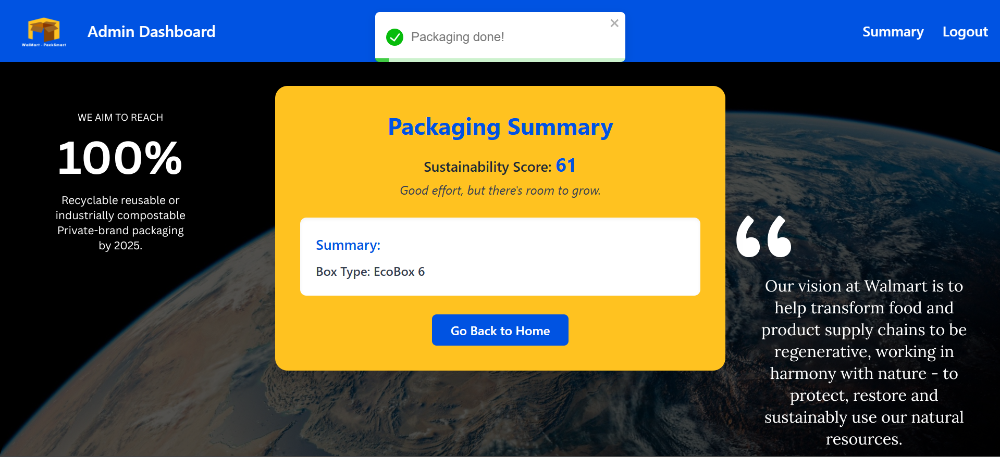

<p align="center">
  
</p>

<p align="center">
  <a href="https://wal-mart-pack-smart.vercel.app/" target="_blank">
    
  </a>
</p>

# WalMart-PackSmart

**Smart Packing. Sustainable Future.**

WalMart-PackSmart is a warehouse assistant tool built to help packers choose the most optimal box for a given set of products — minimizing waste, maximizing space efficiency, and supporting sustainable retail operations.

## 🌍 Why It Matters

In large-scale warehouses like Walmart’s, choosing the right box size and material is more than a logistical decision — it’s an opportunity to reduce waste and support eco-conscious goals. This tool aims to contribute to **retail with purpose** by making packaging decisions smarter and more sustainable.

---

## 🚀 Features

- 📦 **Box Recommendation Engine**  
  Input multiple products and receive the best-fit box and material suggestion based on size, dimensions, and eco-impact.

- 🔍 **Barcode Scanning**  
  Easily scan product barcodes to fetch or register product details.

- 📊 **Dashboard Analytics**  
  Track eco-efficiency, sustainability metrics, and material usage statistics.

- 🧾 **Inventory Management**  
  View, add, and manage scanned items with quantity tracking.

---

## 🛠 Tech Stack

- **Frontend:**  
  - React 19  
  - React Router DOM  
  - React Toastify  
  - Vite  
  - Lucide React  
  - @zxing/browser & @zxing/library for barcode scanning  
  - Axios for API requests  

- **Backend:**  
  - Node.js with Express  
  - MongoDB with Mongoose  
  - JWT for authentication  
  - bcryptjs for password hashing  
  - express-validator for request validation  
  - dotenv for environment configs  
  - `python-shell` to run Python scripts from Node (for box logic or AI-based analysis)

- **Machine Learning:**  
  - Python  
  - A custom-trained model predicts optimal packaging choices based on product dimensions and materials  
  - Integrated via `python-shell` in the backend for real-time inference

---

## ☁️ Deployment

- **Frontend** deployed on **[Vercel](https://vercel.com/)**  
- **Backend & ML Models** deployed on **[Render](https://render.com/)**

> The frontend makes API calls to the Render backend, which internally uses Python scripts (via `python-shell`) to run the ML model for box selection.


## 📂 Project Structure

```bash
WalMart-PackSmart/
├── Frontend/        
├── Backend/  
├── ML/         
└── README.md
```

---

## ⚙️ Getting Started

### Prerequisites

- Node.js and npm installed  
- Python 3 installed  
- MongoDB running (locally or via cloud like Atlas)

### Installation

#### Clone the repo

```bash
git clone https://github.com/ishita-tayal/WalMart-PackSmart.git
cd WalMart-PackSmart
```


#### Setup Backend

```bash
cd Backend
npm install
npm run dev
```

#### Setup Frontend

```bash
cd ../Frontend
npm install
npm run dev
```

#### Setup Machine Learning Model Server

```bash
cd ../ML
pip install -r requirements.txt
python app.py
```


> ✅ Ensure both frontend and backend `.env` files are configured properly.
>
> ✅ The ML server must be running alongside the backend to enable box prediction functionality.

---

## 📸 Screenshots

### 🔍 Login Page


### 🔍 Home Page


### 📦 Box Recommendation


### 📊 Sustainability Score



---

## 👩‍💻 Built By

- **Ishita Tayal**  
- **Nishika Agarwal**  
- **Raghvi Gupta**

We built this with purpose and passion — hoping to contribute a small piece to the larger goal of sustainable commerce.
